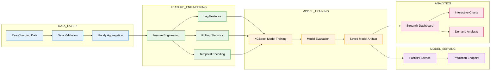

# 🚗⚡ EV Charging Demand Forecasting System

<p align="center">
<b>Machine Learning System for Forecasting EV Charging Demand and Infrastructure Planning</b>
</p>

<p align="center">


</p>

<p align="center">

🔗 <b>Live Demo</b>  
https://ev-charging-demand-forecasting-and-simulator-t9uwyjxiu5hzkjqln.streamlit.app

</p>

---

# 📑 Table of Contents

- [Project Overview](#-project-overview)
- [System Architecture](#-system-architecture)
- [Machine Learning Pipeline](#-machine-learning-pipeline)
- [Dashboard Preview](#-dashboard-preview)
- [Project Structure](#-project-structure)
- [Quick Start](#-quick-start)
- [Docker Deployment](#-docker-deployment)
- [API Example](#-example-prediction-request)
- [Technology Stack](#-technology-stack)
- [Testing](#-testing)
- [Future Improvements](#-future-improvements)

---

# 🌍 Project Overview

Electric vehicle adoption is accelerating globally, creating significant demand for reliable charging infrastructure. Planning charging networks requires **predicting where and when charging demand will occur.**

This project implements a **full machine learning pipeline** that forecasts hourly EV charging demand and provides an **interactive dashboard for analyzing network utilization and infrastructure planning.**

The system demonstrates a realistic ML workflow including:

• Synthetic dataset generation  
• Data preprocessing and validation  
• Temporal feature engineering  
• Machine learning forecasting  
• API-based model serving  
• Interactive analytics dashboard

---

# ✨ Key Highlights

✔ End-to-end ML pipeline

✔ Feature engineered time-series forecasting

✔ FastAPI prediction service

✔ Interactive Streamlit analytics dashboard

✔ Dockerized deployment

✔ Clean modular Python architecture

✔ Reproducible ML workflow

---

# 🏗 System Architecture

The system is designed using a modular ML pipeline architecture.



The diagram visually represents the **data → features → model → serving → analytics workflow** used in the project.

---

# 🧠 Machine Learning Pipeline

The forecasting workflow follows a structured ML lifecycle:

### 1️⃣ Data Generation
Synthetic EV charging sessions simulate realistic demand patterns across charging stations.

### 2️⃣ Data Pipeline
The preprocessing pipeline performs:

• schema validation  
• duplicate removal  
• invalid value handling  
• hourly demand aggregation

### 3️⃣ Feature Engineering

Key engineered features:

• hour / weekday / month indicators  
• cyclical time encoding (sin / cos)  
• lag demand variables  
• rolling demand averages  
• peak-hour indicators

### 4️⃣ Model Training

A gradient boosting model (**XGBoost**) is trained to forecast hourly charging demand, using a chronological train/validation/test split with early stopping and time-series cross-validation. Optional hyperparameter tuning is available via `--hyperparameter-tuning`.

### 5️⃣ Model Serving

The trained model is deployed using **FastAPI** for real-time predictions.

### 6️⃣ Visualization

The Streamlit dashboard allows **interactive analysis of charging demand patterns.**

---

# 📊 Dashboard Preview

The dashboard enables exploration of EV charging demand patterns.

### Network Overview

• Total sessions across the network

• Utilization metrics

• Active charging sites

• Peak demand hours


### Demand Analysis

• Hourly demand heatmaps

• Weekday vs weekend comparison

• State level demand aggregation

• Interactive time series charts


### Interactive Features

• Date range filters

• Dynamic visualizations

• Responsive UI

• Cached data loading

---

# 📁 Project Structure

```
EV-Charging-Demand-Forecasting/

├── data/
│   └── synthetic_generator.py
│
├── ev_forecast/
│   ├── api/
│   │   └── app.py
│   ├── models/
│   │   └── xgboost_model.py
│   ├── data_pipeline.py
│   ├── features.py
│   ├── training.py
│   └── utils/
│
├── dashboard/
│   ├── app.py
│   ├── app_new.py
│   ├── components/
│   └── views/
│
├── notebooks/
│   └── 02_baseline_xgboost.ipynb
│
├── tests/
│
├── Dockerfile
├── docker-compose.yml
├── requirements.txt
└── README.md
```

---

# 🚀 Quick Start

## Clone Repository

```bash
git clone https://github.com/adityagit94/EV-Charging-Demand-Forecasting-and-Simulator.git
cd EV-Charging-Demand-Forecasting-and-Simulator
```

## Install Dependencies

```bash
pip install -r requirements.txt
```

## Generate Dataset

```bash
python data/synthetic_generator.py --sites 10 --days 90
```

## Train Model

```bash
python -m ev_forecast.training
```

This saves a timestamped artifact plus `models/xgboost_baseline.joblib`, which the API serves.

## Start API

```bash
uvicorn ev_forecast.api.app:app --host 0.0.0.0 --port 8000
```

API docs:

```
http://localhost:8000/docs
```

## Run Dashboard

```bash
streamlit run dashboard/app_new.py
```

A minimal single-page version is also available:

```bash
streamlit run dashboard/app.py
```

---

# 🐳 Docker Deployment

The full stack (API, dashboard, Redis, Prometheus, Grafana, nginx) can be started with Docker Compose:

```bash
docker compose up --build
```

| Service | URL |
|------|------|
| API | http://localhost:8000 |
| Dashboard | http://localhost:8501 |
| Prometheus | http://localhost:9090 |
| Grafana | http://localhost:3000 |

---

# 🔌 Example Prediction Request

```json
POST /predict
{
  "site_id": 1,
  "timestamp": "2026-05-01T10:00:00Z",
  "hour_of_day": 10,
  "day_of_week": 4,
  "is_weekend": 0,
  "hour_sin": 0.5,
  "hour_cos": -0.866,
  "lag_1": 5.2,
  "lag_24": 4.8,
  "rmean_24": 5.0
}
```

Response

```json
{
  "prediction": 8.3,
  "site_id": 1,
  "timestamp": "2026-05-01T10:00:00Z",
  "model_version": "1.0.0",
  "confidence_interval": {"lower": 7.5, "upper": 9.1},
  "processing_time_ms": 4.2
}
```

---

# 🛠 Technology Stack

| Layer | Technology |
|------|------|
| Programming | Python |
| Data Processing | Pandas / NumPy |
| Machine Learning | XGBoost |
| API | FastAPI |
| Visualization | Streamlit + Plotly |
| Containerization | Docker |
| Testing | PyTest |

---

# 🧪 Testing

Install the package with dev tools and run the full test suite:

```bash
pip install -e ".[dev]"
pytest
```

With coverage:

```bash
pytest --cov=ev_forecast --cov-report=term-missing
```

---

# 📈 Future Improvements

Potential extensions include:

• Weather-aware demand forecasting  
• Charger placement optimization simulator  
• Geospatial demand modeling  
• Deep learning time-series forecasting  

---

# ⭐ Support

If you found this project useful, consider **starring the repository**.

---

# 📄 License

MIT License

